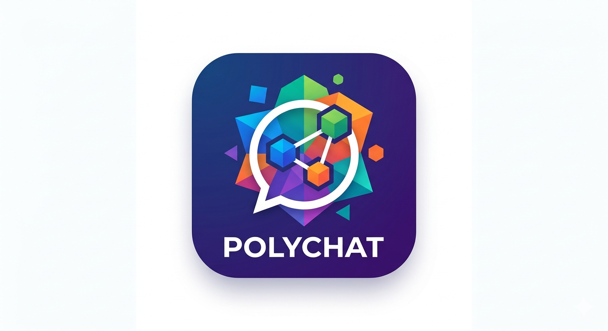
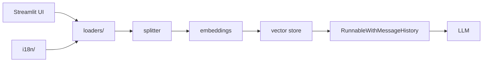

<div align="center">
  
  <h1>PolyChat</h1>
  <p>Chat with <strong>PDFs, CSVs, TXT files, websites, and YouTube videos</strong> — powered by RAG, pluggable LLMs, and an optional fully-offline mode.</p>

  [](https://www.python.org/)
  [](https://www.langchain.com/)
  [](#license)
</div>

---

## Table of contents

1. [Features](#features)
2. [Architecture](#architecture)
3. [Requirements](#requirements)
4. [Run with Docker](#run-with-docker)
5. [Installation (from source)](#installation-from-source)
6. [Configuration](#configuration)
7. [Usage scenarios](#usage-scenarios)
8. [Source-type walkthroughs](#source-type-walkthroughs)
9. [Persistence](#persistence)
10. [Language switching](#language-switching)
11. [Troubleshooting](#troubleshooting)
12. [Development](#development)
13. [Contributing](#contributing)
14. [Project structure](#project-structure)
15. [Roadmap / out of scope](#roadmap--out-of-scope)
16. [License](#license)

---

## Features

- **5 source types:** PDF, CSV, TXT, website URL, YouTube URL.
- **4 LLM providers:** OpenAI, Anthropic, Groq, Ollama — swappable from the UI.
- **2 embedding providers:** OpenAI (cloud) and HuggingFace (fully local, multilingual).
- **3 vector-store backends:** Chroma (default), FAISS, Qdrant — all behind one toggle.
- **Persistent or ephemeral index** at the user's choice.
- **Conversational memory** with history-aware query rewriting, so follow-up questions work.
- **Multi-language UI:** English + Portuguese ship out of the box. Adding a language is a single JSON file.
- **100% free & offline mode** with Ollama + HuggingFace embeddings — no API keys, no network.
- **Citations by source:** every chunk carries its source; YouTube citations deep-link to the exact timestamp.
- **Strict-typed Python** (`pyright` strict), linted by `ruff`, gated by pre-commit.

---

## Architecture



All RAG modules are pure, testable functions — the Streamlit app wires them together but contains no retrieval logic itself.

---

## Requirements

- **Python 3.11+**.
- **[uv](https://docs.astral.sh/uv/)** recommended (falls back to `pip` fine).
- *(Optional)* **Ollama** for the fully-offline stack — [install](https://ollama.com/download) and `ollama serve`.
- *(Optional)* API keys for OpenAI / Anthropic / Groq. Fill only the ones you plan to use.

---

## Run with Docker

The fastest way to try PolyChat is with Docker — no Python, no `uv`, no dependency juggling. Indexes and the HuggingFace model cache persist in a named volume.

**Pull the prebuilt image (recommended):**

```bash
curl -O https://raw.githubusercontent.com/leodrivera/polychat/main/.env.example
mv .env.example .env           # then edit to add the provider keys you want

docker run --rm -p 8501:8501 \
  --env-file .env \
  -v polychat-data:/data \
  ghcr.io/leodrivera/polychat:latest
```

**Docker Compose — cloud providers (OpenAI / Anthropic / Groq):**

```bash
git clone -b main https://github.com/leodrivera/polychat.git
cd polychat
cp .env.example .env           # fill in at least one API key

docker compose up              # add -d to run detached
```

**Docker Compose — fully offline with Ollama (no API keys needed):**

```bash
git clone -b main https://github.com/leodrivera/polychat.git
cd polychat
cp .env.example .env           # HF_TOKEN recommended; no API keys required

docker compose -f docker-compose.ollama.yml up -d

# Pull a model (one-time):
docker compose -f docker-compose.ollama.yml exec ollama ollama pull llama3.1:8b

# In the sidebar: Provider = Ollama · Model = llama3.1:8b · Embeddings = HuggingFace (local)
```

Open http://localhost:8501.

- Images are published on every release tag to `ghcr.io/leodrivera/polychat` (tags: `latest`, `<major>`, `<major>.<minor>`, `<major>.<minor>.<patch>`). Multi-arch (`linux/amd64`, `linux/arm64`).
- State lives in the `polychat-data` volume. Wipe with `docker compose down -v`.

---

## Installation (from source)

```bash
git clone -b main https://github.com/leodrivera/polychat.git
cd polychat

uv sync                       # or: python -m venv .venv && source .venv/bin/activate && pip install -e .
cp .env.example .env          # fill in the keys you want to use

uv run streamlit run src/polychat/app.py
# or, equivalently, once the package is installed:
polychat
```

Open http://localhost:8501 and you're in.

---

## Configuration

All configuration lives in `.env` (see [`.env.example`](./.env.example)):

```env
OPENAI_API_KEY=
ANTHROPIC_API_KEY=
GROQ_API_KEY=

OLLAMA_BASE_URL=http://localhost:11434

HF_TOKEN=               # optional — removes HuggingFace rate-limit warning

YT_PROXY_HTTP=          # optional — only needed if YouTube blocks your IP
YT_PROXY_HTTPS=
```

Only the keys you actually use need values. The app validates each provider at **Initialize RAG** time and surfaces a localized error when a key is missing.

---

## Usage scenarios

Each scenario is a self-contained recipe: env vars, sidebar selections, and what to expect.

### Scenario A — Best quality (OpenAI + OpenAI embeddings)

- **Env:** `OPENAI_API_KEY`.
- **Sidebar → Model Selection:** Provider = `OpenAI` · Model = `gpt-4o` · Embeddings = `OpenAI (cloud)`.
- **Sidebar → File Upload:** Persist = off.
- **Notes:** highest answer quality, cloud cost applies.

### Scenario B — Fast & cheap cloud (Groq + OpenAI embeddings)

- **Env:** `GROQ_API_KEY`, `OPENAI_API_KEY`.
- **Sidebar:** Provider = `Groq` · Model = `llama-3.3-70b-versatile` · Embeddings = `OpenAI (cloud)`.
- **Notes:** Groq is ~10× faster than OpenAI at similar quality for this tier. Works well for interactive chat on large corpora.

### Scenario C — Free cloud (Groq + HuggingFace local embeddings)

- **Env:** `GROQ_API_KEY` (free tier is plenty).
- **Sidebar:** Provider = `Groq` · Model = `llama-3.1-8b-instant` · Embeddings = `HuggingFace (local, multilingual)`.
- **Notes:** embeddings run locally on CPU (~120 MB download on first use, cached under `~/.cache/huggingface`). Zero OpenAI spend.

### Scenario D — 100% free and fully offline (Ollama + HuggingFace)

Prereqs:

```bash
# Install Ollama: https://ollama.com/download
ollama serve &                 # background
ollama pull llama3.1:8b        # ~4.7 GB
# Smaller alternative:
# ollama pull phi3:mini        # ~2.3 GB
```

- **Env:** none required. Leave `.env` empty.
- **Sidebar:** Provider = `Ollama` · Model = `llama3.1:8b` · Embeddings = `HuggingFace (local, multilingual)`.
- **Verify offline:** disconnect your network — everything still works. The first query warms the Ollama model (a few seconds on CPU, instant on GPU).

### Scenario E — Claude for long, dense documents

- **Env:** `ANTHROPIC_API_KEY`.
- **Sidebar:** Provider = `Anthropic` · Model = `claude-sonnet-4-6` · Embeddings = `OpenAI (cloud)`.
- **Notes:** strong reasoning on technical PDFs; very large context windows.

---

## Source-type walkthroughs

### PDF
Upload a product manual (e.g., `manual.pdf`) and ask `What does a flashing red light mean?` — the answer cites the PDF's filename.

### CSV
Upload a small `orders.csv`; ask `How many rows have country=BR?` — each row becomes its own Document, so row-level questions land precisely.

### TXT
Great for READMEs, chat logs, or policy files. Simple and fast.

### Website
Paste a full URL like `https://en.wikipedia.org/wiki/Retrieval-augmented_generation`. **Caveats:** sites behind Cloudflare, paywalls, or JavaScript-only rendering may return 403 or produce empty content. For those, save the page as HTML or copy the article into a `.txt` and use the TXT source.

### YouTube
Paste any of:

- `https://www.youtube.com/watch?v=<id>`
- `https://youtu.be/<id>`
- `https://www.youtube.com/shorts/<id>`
- `https://www.youtube.com/embed/<id>`

The app fetches the transcript via `youtube-transcript-api` (v1.2.4+). Manually-created transcripts are preferred; auto-generated ones are used as fallback. The preferred language follows the UI locale (`pt_br` → tries `pt-BR`, `pt`, then `en`).

- **Live streams and videos without transcripts** are not supported.
- **Shorts are supported.**
- Each snippet's citation includes a **deep link to the timestamp** (e.g., `&t=42s`) — click and you land at the exact moment.

If your IP is blocked by YouTube (common on cloud VMs), set `YT_PROXY_HTTP` / `YT_PROXY_HTTPS` in `.env`.

---

## Persistence

- Enable **Persist index** on the sidebar **before** clicking *Initialize RAG*.
- This writes the vector store to disk:
  - Chroma → `./chroma_db/`
  - FAISS → `./faiss_index/`
  - Qdrant → `./qdrant_data/`
- Restarting Streamlit will reload the persisted index automatically.
- To wipe, delete the directory.

A `.fingerprint` sidecar records which embedding model produced the index. Switching embedding providers raises `errors.embeddings_changed` until you re-initialize — you can't mix vectors from different embedders.

---

## Language switching

- The selector lives in **Sidebar → Model Selection → Language**.
- Shipped: `en` (default) and `pt_br` (matching the original screenshots).
- **Adding a new language** (zero code):

  ```bash
  cp src/polychat/i18n/en.json src/polychat/i18n/es.json
  # Edit the file:
  #   "_meta": { "name": "Español", "code": "es" }
  # …then translate every other value.
  ```

  Restart Streamlit — "Español" appears in the language selector automatically.

The UI language is **independent from the answer language**. The LLM answers in whatever language your question is written in, thanks to the QA prompt.

---

## Troubleshooting

| Symptom | Fix |
|---|---|
| `Missing API key for OpenAI` | Set `OPENAI_API_KEY` in `.env` (same for other providers). |
| `This video does not have a transcript available.` | Try another video; captions must be enabled. Auto-generated subs are accepted. |
| YouTube `IpBlocked` / `RequestBlocked` | Set `YT_PROXY_HTTP` / `YT_PROXY_HTTPS` in `.env`. |
| Ollama "connection refused" | Start the daemon: `ollama serve`. Check `OLLAMA_BASE_URL`. |
| HuggingFace first download is slow | Expected. Models are cached under `~/.cache/huggingface`; subsequent runs are instant. |
| `Embeddings changed — please re-initialize the RAG` | You switched embedding providers after indexing. Click **Initialize RAG** again. |
| Streamlit file upload rejected | Default limit is 200 MB per file. Split very large PDFs or raise `server.maxUploadSize` in `.streamlit/config.toml`. |

---

## Development

```bash
uv sync --group dev
uv run pre-commit install          # wire up git hooks

# Run the whole gate locally (same as CI):
uv run pre-commit run --all-files

# Piece by piece:
uv run ruff check .
uv run ruff format --check .
uv run pyright
uv run pytest                      # fast unit suite, no network
uv run pytest -m integration       # opt-in, hits APIs / Ollama

uv run streamlit run src/polychat/app.py
```

Every commit runs **ruff → pyright → unit tests → hygiene checks**. CI runs the same gate on every push and pull request.

---

## Contributing

1. **Fork** the repo and clone your fork.
2. **Branch from `dev`**.
   ```bash
   git checkout dev
   git checkout -b feat/my-feature
   ```
3. **Set up the dev environment** (see [Development](#development) above).
4. Make your changes, keeping all pre-commit checks green.
5. **Open a PR targeting `dev`**.

---

## Project structure

```
polychat/
├── src/polychat/
│   ├── app.py                    # Streamlit entrypoint — UI wiring only
│   ├── cli.py                    # `polychat` console entrypoint
│   ├── i18n/                     # t(), available_locales(), locale JSON files
│   ├── rag/
│   │   ├── loaders/              # PDF/CSV/TXT/site/YouTube loaders
│   │   ├── splitter.py
│   │   ├── embeddings.py         # OpenAI + HuggingFace local
│   │   ├── vector_store.py       # Chroma / FAISS / Qdrant factory
│   │   ├── llm.py                # OpenAI / Anthropic / Groq / Ollama factory
│   │   └── chain.py              # history-aware retrieval chain
│   └── prompts/qa.py
├── tests/
│   ├── conftest.py               # DeterministicEmbeddings, YouTube fakes, tiny_locale_dir
│   ├── unit/                     # fast, no-network suite (runs on every commit)
│   └── integration/              # opt-in; requires API keys / network
├── Dockerfile
├── docker-compose.yml            # cloud providers (OpenAI / Anthropic / Groq)
├── docker-compose.ollama.yml     # fully-offline stack with Ollama
├── .pre-commit-config.yaml
├── .github/workflows/ci.yml
├── .github/workflows/release.yml
├── .github/workflows/docker-publish.yml
├── pyproject.toml                # deps + ruff + pyright + pytest config
└── .env.example
```

---

## Roadmap / out of scope

Explicitly **not** in v1:

- Multi-user auth or per-user indexes.
- OCR for scanned PDFs (assumes a text layer).
- Audio/video transcription (YouTube uses existing captions only).
- Re-ranking, hybrid BM25+vector, or query rewriting beyond the history-aware retriever.
- Auto-translating answers based on the UI language (answers follow the user's question language).
- An evaluation harness (`ragas`, `deepeval`).

---

## License

MIT.
